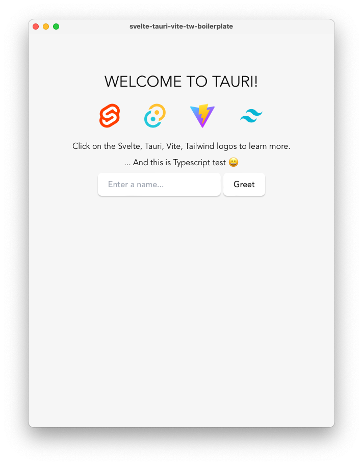

# Tauri + Svelte + Typescript + Vite + TailwindCSS

[![Github Tag][github-tag-image]][github-tag-url]

This boilerplate should help get you started developing with <a href="https://tauri.app">Tauri</a>, <a href="https://svelte.dev">Svelte</a> and <a href="https://www.typescriptlang.org">TypeScript</a> in <a href="https://vitejs.dev">Vite</a> with <a href="https://tailwindcss.com">TailwindCSS</a>! It also comes with DaisyUI 🌼 which you can choose not to use.

<div align="center">
  

</div>

## Install

Clone the repo, or download as a zip file:

```bash
yarn
```

## Development

Start the app in `development` mode (hot-code reloading, error reporting, etc.)

```bash
yarn tauri dev
```

## Build

Build the app for production

```bash
yarn tauri build
```

## Help with Tauri

```bash
yarn tauri help
```

## Disabling DaisyUI

```json
// tailwind.config.js
export default {
...
  // remove require("daisyui") if you don't want to use daisyUI
  // plugins: [require("daisyui")],
  plugins: [],
};

```
